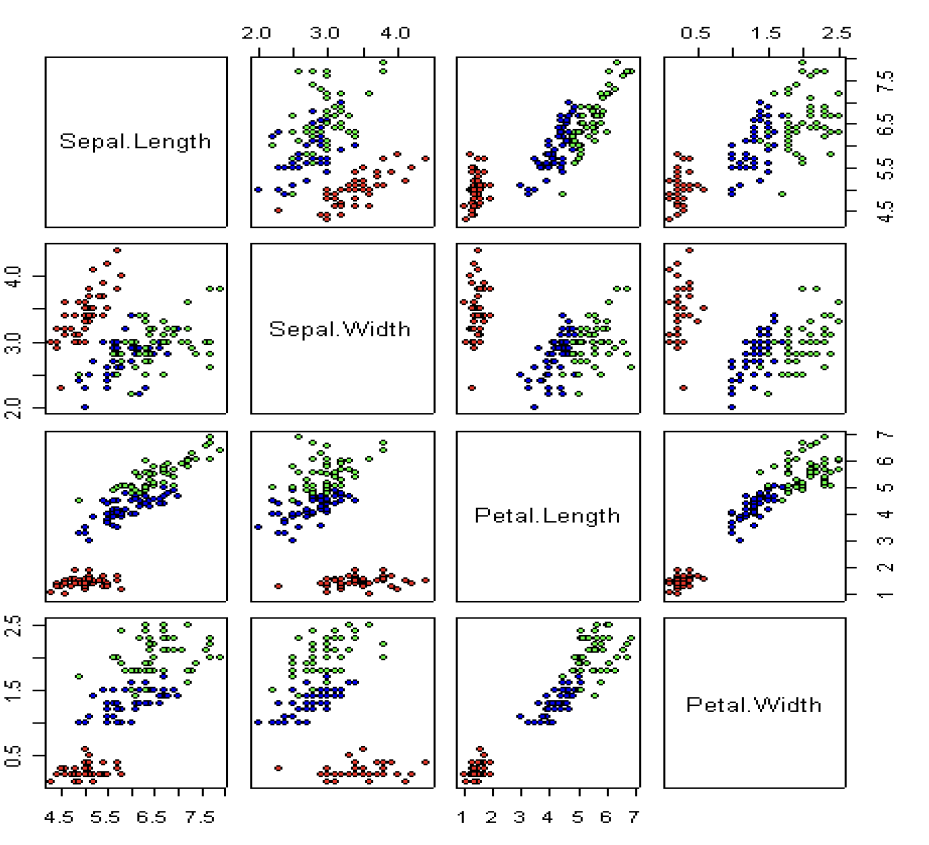
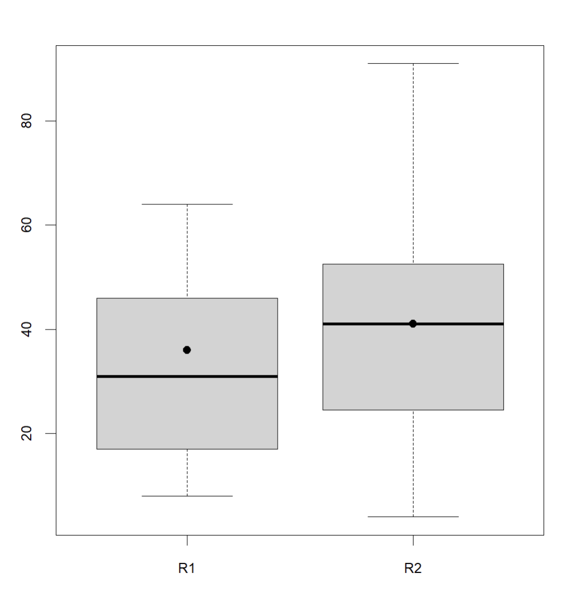
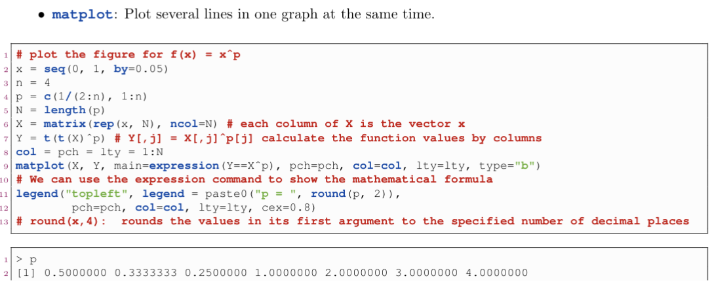

# Intro and notes
## Intro and def
1. defs (?) 
    1. graphic: a "plot", eg a histogram, pie chart ...
    1. frame: a single picture is called a frame, can contain sub graphics

## Notes
1. High / low level plots:   
    mine: well wrapped up for you, don't need to care about the details of ... 
    Lec3 P3  
    In contrast is the low level plot functions. Are more specific, detailed. High and low level functions can be used together, eg, to add some details to high level plots using low level functions.
    
1. When drawing high level plots, whenever draw a new one, will draw on another frame (eg multi-frame, go to the next frame; if no multi-frame just restart a plot). When low level plot, will by default add to the current plot.
    When directly draw at start, better not use low level plot, might not have any results. (Or can, just initialize the configuration)
    
# Start a plot

1. Setup a new frame (signifying a new frame)
    `plot.new()` or `frame()` (alias)
    Note: but the params and things won't change
    
1. a common way

    ```
    plot(0, 0, type="n", xlim=c(0,10), ylim=c(0,10), bty="n")
    ```

# Save plot

1. Simple: simply copy the plot window and paste it into an appropriate file type, such as a Word document.

1. use functions

    1. procedure  
        1. use the `pdf()` function to create a pdf, or `jpeg()` function to create a jpeg. 
        1. do the plot
        1. dev.off()
        
    1. eg
    
        ```
        pdf("Figure.pdf")
        plot(lnpd86,lnpd90,main="log pd90 vs log pd86")
        abline(lsfit(lnpd86,lnpd90))
        dev.off()
        ```
        
# General operations
    
1. Configurations using `par()`  
    General options are mainly configured in `par()`. Details of `par()` can be inspected using `help()`. Below serves as a result oriented list.  
    Many things set in `par()` can also be set when calling the detailed plot function. eg `lty`, `cex` ...
    `par(...)`: means param: is to configure graphical param

    1. Plot arrangement in frames
        1. sub graphics in a single frame  
            `par(mfrow=c(2,2))`  
            Explain:  
            1. `mfrow` means multi-frame filled row-wise. `mfcol`: column-wise  
            1. `c(2,2)`: the configuration of sub-frame  
            1. `c(m, n)` means m row and n col
        1. A common title for sub-plots: call par for multiple times  
        
            ```
            par(mfrow=c(1,3))
            # boxplot(...) for 3 times
            par(mfrow=c(1,1))
            title(sub="ln pd86 vs ln pd90 by Region")
            ```
        
        Then just do plotting four times without the need to specify which subplot, will fill automatically.
        
    1. line, box, point ... types  
        1. `lty`
             (0=blank, 1=solid (default), 2=dashed, 3=dotted, 4=dotdash, 5=longdash, 6=twodash) or as one of the character strings "blank", "solid", "dashed", "dotted", "dotdash", "longdash", or "twodash", where "blank" uses ‘invisible lines’ (i.e., does not draw them).
        1. `lwd`
            The line width, a positive number, defaulting to 1. The interpretation is device-specific, and some devices do not implement line widths less than one.
        1. `bty`
            A character string which determined the type of box which is drawn about plots.  
            If bty is one of "o" (the default), "l", "7", "c", "u", or "]" the resulting box resembles the corresponding upper case letter.  
            A value of "n" suppresses the box.
        1. `pch`
            type of the points. Some common: 19=solid circle, 20=bullet, 21=circle, 22=square, 23=diamond, 24=triangle point‐up, 25=triangle point down
             
    1. text related

        1. `cex` family  

            1. `cex`
                character expansion factor. It indicates the amount by which the text and symbols should be scaled relative to the default size. 1 is default, 1.5 is 50% larger, 0.5 is 50% smaller, etc.
  
            1. `cex.axis`
                The magnification to be used for axis annotation relative to the current setting of cex.  
                Note: in some functions (eg `barplot()`), have another `cex.names` parameter separately defined from `cex.axis`. (then cex.axes means the cex of numbers on axes, while cex.names means the words on axes)
    
            1. `cex.lab`
                The magnification to be used for x and y labels relative to the current setting of cex.
    
            1. `cex.main`, `cex.sub`
                The magnification to be used for main / sub titles relative to the current setting of cex.
            
        1. las: style (arrangement of axis labels)    
            Note: can also be configured in `mtext`  
            
            ```
            numeric in {0,1,2,3}; the style of axis labels.

            0: always parallel to the axis [default],
            
            1: always horizontal,
            
            2: always perpendicular to the axis,
            
            3: always vertical.
            ```
            
    
    1. color related
        1. `bg`
            The color of the background when calling in par. In some graphic functions, can also be called and this means the color of points / lines ... and can be passed as vectors.
            
            ```
            # region is a vector consisting of three different string of "HK" "KL" and "NT", and will be in different color in this case.
            plot(d$lnpd86,d$lnpd90,pch=21,bg=c("red","blue","green")[d$Region])
            ```
            
        1. `col`:
            Can also be used in specific functions, is used generally for the color of lines / bars and other non points thing.
            
            ```
            abline(h=min(s),col="red",lty=2)
            barplot(d$lnpd90, horiz=T, col=rainbow(20))   # means up to 20 in the rainbow colors
            ```
            
        1. `border`: color of the border around bars, charts, ...
    
# High level graphis function for basic graphs

## Common Notes among all graphs
1. Many settings used in `par()` can be used in specific plotting below. eg `lty`, `cex`, won't be specified here

1. legend related 
    Note: some plot functions may not have (some of the below) legend parameters, for details, check the function specific syntax

    1. `legend`: 
        set to `T` or `F` means whether or not to display legend. If no other params specified, display the default legend.
    
    1. `legend.text`: 
        can be logical value (then display default) or a vector of text (so corresponds to the order).
    
        ```
        legend.text=c("HK","KL","NT")
        ```
        
    1. `args.legend`: 
        list of additional arguments to pass to legend(). See legend for details.
        
        ```
        args.legend=list(x="topright",bty="n",inset=c(-0.08, -0.02),cex=0.8)
        ```
        
1. label related options
    1. `main`, `sub`: the main / sub title of the plot that will be shown on plot
    1. `xlab`, `ylab` means the label of x / y axis (like "velocity"-"time" plot's velocity and time), often the default value is the name of the vector.
    
    1. `axes`: the x, y axis including its ticks and values. `T` for draw, `F` for not draw 
    
    1. `ann`: logical. Should annotations (titles and axis titles) be plotted?
    
    1. `log`: string specifying if axis scales should be logarithmic
    
    1. `names.arg`:
        seen in `barplot`
        a vector of names to be plotted below each bar or group of bars. If this argument is omitted, then the names are taken from the names attribute of height if this is a vector, or the column names if it is a matrix.
        
        ```
        names.arg=c("HK","KL","NT")
        ```
    1. `add` logical; if TRUE add to an already existing plot; if NA start a new plot taking the defaults for the limits and log-scaling of the x-axis from the previous plot. Taken as FALSE (with a warning if a different value is supplied) if no graphics device is open.


1. Common misc params (non `par()`)
    1. `col`: for specifying the color. See `par()` for details
    1. `xlim`, `ylim`: eg `xlim=c(0,15)`
    1. `plot`: logical value, if `T` do plot, else just print the stats in console
        Note: don't confuse with `xlab` `ylab`.
        logical or character. Additionally draw labels on top of bars, if not FALSE; if TRUE, draw the counts or rounded densities; if labels is a character, draw itself.
    1. `density`, `angle` are for shading lines


## plot(): not only Scatter plot

1. Note: Use keyword `plot()` can do scatter plot, but doesn't mean `plot()` is only for scatter plot.

1. Syntax  

  ```
  plot(x, y = NULL, type = "p",  xlim = NULL, ylim = NULL,
       log = "", main = NULL, sub = NULL, xlab = NULL, ylab = NULL,
       ann = par("ann"), axes = TRUE, frame.plot = axes,
       panel.first = NULL, panel.last = NULL, asp = NA,
       xgap.axis = NA, ygap.axis = NA,
       ...)
  ```
  
  1. `type`: 1-character string giving the type of plot desired. The following values are possible, for details, see plot: "p" for points, "l" for lines, "b" for both points and lines, "c" for empty points joined by lines, "o" for overplotted points and lines, "s" and "S" for stair steps and "h" for histogram-like vertical lines. Finally, "n" does not produce any points or lines.
  1. `main` and `sub` are the main and sub title
  1. `bg` is the color of the points. Each point should have a color (len of this param should eaqual to x and y). Eg `bg=c("red", "green", "blue")[region]` where region is a long vector of many `HK`, `NT` and `KL`.e
  1. `pch` type(shape) of point. Each point should have a type (len of this param should eaqual to x and y).
  


1. Usages  

    1. scatter plot
        set `type` parameter to "p"
    
    1. Time series plot  
        time series is a special kind of datatype and has its own plotting methods.  
        See lec3 P54-60
        
    1. plot curves
        set `type` parameter to "l"

1. Advanced

    1. Matrix scatter plot: `pairs()`  
    
        ```
        d <- read.csv("iris.csv")
        pairs(d[,1:4],pch=21,bg=c("red","blue","green")[d$Species])
        ```
        Use keyword `pairs`, then for `d[,1:4]` of shape (num_data, 4), give pairs of scatter plot  
        
        {width=40%}

1. Family methods

    1. `matplot()`: see section `Advanced plots`.
    
    1. plot a dataframe has special syntax using `~`
    
        ```
        plot(circumference~age, pch=as.numeric(as.character(Tree)), data=Orange)
        ```

    

## Curve lines

Plot the curve given x and y: multiple ways

1. using `plot()`  

    see plot section

1. using `curve()`  

    1. syntax  
    
        ```
        curve(expr, from = NULL, to = NULL, n = 101, add = FALSE,
              type = "l", xname = "x", xlab = xname, ylab = NULL,
              log = NULL, xlim = NULL, ...)
        ```

        
    1. eg.
        ```
        curve(x*sin(x),-4*pi,4*pi)
        ```     
1. using `lines()`  
    see low level function section for adding lines in plots


## Histogram

1. Syntax:

    ```
    hist(x, breaks = "Sturges",
         freq = NULL, probability = !freq,
         include.lowest = TRUE, right = TRUE, fuzz = 1e-7,
         density = NULL, angle = 45, col = "lightgray", border = NULL,
         main = paste("Histogram of" , xname),
         xlim = range(breaks), ylim = NULL,
         xlab = xname, ylab,
         axes = TRUE, plot = TRUE, labels = FALSE,
         nclass = NULL, warn.unused = TRUE, ...)
    ```
    
    1. `labels`: 
        Means the labels labeled on in the plot regions (eg above the bar chart)
    1. `nclass`: number of bins, `breaks`: can be an algorithm or a vector (which is the boundary of each intervals)

    


## Pie charts

1. Syntax  

    ```
    pie(x, labels = names(x), edges = 200, radius = 0.8,
        clockwise = FALSE, init.angle = if(clockwise) 90 else 0,
        density = NULL, angle = 45, col = NULL, border = NULL,
        lty = NULL, main = NULL, ...)
    ```
    
    1. `edges`: the circular outline of the pie is approximated by a polygon with this many edges. `edges` means the num of edges
    
## Bar charts
1. Syntax

      ```
      barplot(height, width = 1, space = NULL,
              names.arg = NULL, legend.text = NULL, beside = FALSE,
              horiz = FALSE, density = NULL, angle = 45,
              col = NULL, border = par("fg"),
              main = NULL, sub = NULL, xlab = NULL, ylab = NULL,
              xlim = NULL, ylim = NULL, xpd = TRUE, log = "",
              axes = TRUE, axisnames = TRUE,
              cex.axis = par("cex.axis"), cex.names = par("cex.axis"),
              inside = TRUE, plot = TRUE, axis.lty = 0, offset = 0,
              add = FALSE, ann = !add && par("ann"), args.legend = NULL, ...)
      ```

    1. horiz=T produces a horizontal bar

    1. `beside=T` sets the grouped bar to be side‐by‐side instead of stacked.  
    1. `xpd`: logical. Should bars be allowed to go outside region?
  


    
1. Egs.

    1. grouped bar plot (the grouping is by cols)
        Use a matrix. Each column is grouped together
    
        ```
        rs
                yr86 yr90
        HK 28.61877 28.54684
        KL 86.26508 85.29111
        NT 57.95122 60.23391
        
        # vertical
        barplot(t(rs),beside=T,horiz=F,
                legend.text=c("yr86","yr90"),main="log(density)")
        
        # horizontal
        barplot(rs,beside=T, horiz=T, xlim=c(0,100),
                ylim=c(0,10), legend.text=c("HK","KL","NT"),
                args.legend=list(horiz=T,bty="n"),main="log(density)")
        ```
        
        

1. return value

    A numeric vector (or matrix, when beside = TRUE), say mp, giving the coordinates of all the bar midpoints drawn, useful for adding to the graph.
    If beside is true, use colMeans(mp) for the midpoints of each group of bars, see example.
    
    ```
    y<-barplot(d$lnpd90,horiz=T,col="white",xlim=c(0,15), main="log(Density) HK1990") 
    x<-round(d$lnpd90,1)
    text(0.5*x,y,d$district,cex=0.8)
    text(x+0.8,y,labels=x,cex=0.8)
    ```

## Box plot

1. Syntax

    ```
    boxplot(x, ..., range = 1.5, width = NULL, varwidth = FALSE,
        notch = FALSE, outline = TRUE, names, plot = TRUE,
        border = par("fg"), col = "lightgray", log = "",
        pars = list(boxwex = 0.8, staplewex = 0.5, outwex = 0.5),
         ann = !add, horizontal = FALSE, add = FALSE, at = NULL)
    ```
    
    1. `range`: determines how far the plot whiskers extend out from the box. If range is positive, the whiskers extend to the most extreme data point which is no more than range times the interquartile range from the box. A value of zero causes the whiskers to extend to the data extremes.
    1. `width` and `varwidth` are for the distance between boxes.
    1. `outline`: if outline is not true, the outliers are not drawn
    1. `names`: axes names of each box

1. eg

    1. 
    
        ```
        > yr <- c(rep(86, 20), rep(90, 18))
        > pd
         [1]  8.495050  7.706225 12.302366  9.423615  7.806626  8.210457
         [7]  9.956463  9.382136 12.441562 11.227524  8.743441 12.335675
        [13] 12.948431 11.897643  9.859023  9.968771  9.565116  8.314174
        [19]  9.550573 14.462239  9.701815 11.128456  9.862916 10.488372
        [25] 12.674530  8.862424 12.082842 12.634275 13.350876 14.558758
        [31] 10.506432 15.107069 11.191977 10.988099 14.590922 12.315276
        [37] 17.162754 17.231083
        > boxplot(pd ~ yr, main="pd86 vs pd90", col=c("lightblue", "lightgreen"))
        ```
        should be y ~ x  
        {width=40%}
        
    1. 
    
        ```
        # the x label is just 1, 2, ...
        > head(data)
          R1 R2
        1 39 91
        2 56 43
        3 46 24
        4 31 25
        5 60 78
        6 43 37
        > boxplot(data)
        > points(x=1,36,pch=19)
        > points(x=2,41,pch=19)
        ```
        
        {width=40%}
        


## QQ plot
1. Intro: 
    Intro: lec3 P23
    Remarks: lec3 P30-31
    

1. normal QQ plot (test if is normal distr)

    `qqnorm()` to provide plot and `qqline()` to add a reference line to the plot

    1. syntax
        
        ```
        qqnorm(y, ylim, main = "Normal Q-Q Plot",
           xlab = "Theoretical Quantiles", ylab = "Sample Quantiles",
           plot.it = TRUE, datax = FALSE, ...)
    
        qqline(y, datax = FALSE, distribution = qnorm,
               probs = c(0.25, 0.75), qtype = 7, ...)
        ```
        1. plot.it: logical. Should the result be plotted?

    1. egs
    
        ```
        qqnorm(d$year86,main="Normal Q-Q plot for 1986")
        qqline(d$year86,col="red")
        ```
1. general

    ```
    n <- length(sample_data)
    data_sorted <- sort(sample_data)
    i <- ((1:n) - 0.5) / n  # ? no need -0.5
    q <- q<target_dist>(i)
    
    plot(q, data_sorted, main='QQ plot')
    abline(lsfit(q, data_sorted), col='red')
    ```

# Advanced plots

1. Plot multiple columns of a matrix in one figure: like plotting each columns separately
    Use keyword `matxxx`  

    1. Syntax:
    
        ```
          matplot(x, y, type = "p", lty = 1:5, lwd = 1, lend = par("lend"),
                  pch = NULL,
                  col = 1:6, cex = NULL, bg = NA,
                  xlab = NULL, ylab = NULL, xlim = NULL, ylim = NULL,
                  log = "", ..., add = FALSE, verbose = getOption("verbose"))

        matpoints(x, y, type = "p", lty = 1:5, lwd = 1, pch = NULL,
                  col = 1:6, ...)
        
        matlines (x, y, type = "l", lty = 1:5, lwd = 1, pch = NULL,
                  col = 1:6, ...)
        ```
        
    1. egs  
    
        {width=80%}
        {width=80%}
        {width=50%}
      
# Low level graphics functions

## 1. Concepts on R drawing

Base graphics in R divides up the display into several
regions  

{width=50%}

1. Plot region:  
    where data will be drawn.  
    1. Within the plot region R maintains a coordinate system
based on the data.  

1. margins:  
    Outside the plot region are the margins  
    1. numbered clockwise from 1 to 4, starting at the bottom.
    1. Normally text and labels are plotted in the margins  
    1. R positions objects based on a count of lines out from the plot region.

## 2. Low level functions adding to plot regions (plotting)

1. Adding points or (curved) lines

    ```
    points(xs, ys, ...) # adds points
    lines(x, ys, ...) # adds line (not segments if possible)
    ```
    
    eg
    
    ```
    # eg 1
    > points(rnorm(200), rnorm(200), col = "red")
    > lines(rnorm(200), rnorm(200), col = "red")    # add line segment (maybe because it cannot be lines)
    
    # eg 2
    x1 <- seq(-3,-sqrt(3)-0.001,by=0.001)
    x2 <- seq(-sqrt(3)+0.001,sqrt(3)-0.001,by=0.001)
    x3 <- seq(sqrt(3)+0.001,3,by=0.001)
    y1 <- (x1^4-2*x1^3-3*x1^2+x1+1)/(x1^2-3)
    y2 <- (x2^4-2*x2^3-3*x2^2+x2+1)/(x2^2-3)
    y3 <- (x3^4-2*x3^3-3*x3^2+x3+1)/(x3^2-3)
    plot(x1,y1,type="l",xlim=c(-3,3),ylim=c(-250,250))
    lines(x2,y2)
    lines(x3,y3)
    ```

1. Add straght line according to k and b

    1. syntax  
  
        ```
        abline(a = NULL, b = NULL, h = NULL, v = NULL, reg = NULL,
               coef = NULL, untf = FALSE, ...)
        ```
        1. `a, b`: the intercept and slope, single values.
        
    1. eg  

        ```
        abline(a, b, ...) # adds the line $y = a + bx$
        abline(h = y, ...) # adds a horizontal line
        abline(v = x, ...) # adds a vertical line
        ```
    
1. Line segments

    1. syntax
    
        ```
        segments(x0, y0, x1, y1, ...) # draws line segments
        arrows(x0, y0, x1, y1, ...) # draws line segments with arrows
        ```
        
    1. eg
    
        ```
        # draw a triangle
        segments(-1,200,0,200)
        segments(-1,100,0,200)
        segments(-1,100,-1,200)
        ```
        
1. common symbols

    keyword: `symbols()`  
    draws symbols on a plot. One of six symbols; circles, squares, rectangles, stars, thermometers, and boxplots, can be plotted at a specified set of x and y coordinates.
    
    1. syntax  
    
    ```
    symbols(x, y = NULL, circles, squares, rectangles, stars,
        thermometers, boxplots, inches = TRUE, add = FALSE,
        fg = par("col"), bg = NA,
        xlab = NULL, ylab = NULL, main = NULL,
        xlim = NULL, ylim = NULL, ...)
    ```
      1. `x, y`: coordinate
      1. `circles`: a vector giving the radii of the circles
      1. `squares`: a vector giving the length of the sides of the squares.
      1. `inches`: inches controls the sizes of the symbols. If TRUE (the default), the symbols are scaled so that the largest dimension of any symbol is one inch. If a positive number is given the symbols are scaled to make largest dimension this size in inches (so TRUE and 1 are equivalent). If inches is FALSE, the units are taken to be those of the appropriate axes. (For circles, squares and stars the units of the x axis are used.
      1. `add`: if add is TRUE, the symbols are added to an existing plot, otherwise a new plot is created.

1. Others plots
    1. polygon
        adds a closed and possibly filled polygon
        `polygon(xs, ys, ...)`

1. Add text
    1. Syntax   
    
        ```
        text(x, y = NULL, labels = seq_along(x$x), adj = NULL,
             pos = NULL, offset = 0.5, vfont = NULL,
             cex = 1, col = NULL, font = NULL, ...)
        ```
        
        1. `x, y`: numeric vectors of coordinates where the text labels should be written. If the length of x and y differs, the shorter one is recycled.
        1. `labels`:	a character vector or expression specifying the text to be written.
        
    1. Eg
        1. On barplot  
        
            ```
            y<-barplot(d$lnpd90,horiz=T,col="white",xlim=c(0,15),main="log(Density) HK1990")
            
            text(0.5*x,y,d$district,cex=0.8)
            # add legend inside the bar
            text(x+0.8,y,labels=x,cex=0.8)
            # add number at the end
            ```

1. Add legend: `legend()`

    1. syntax  
    
        ```
        legend(x, y = NULL, legend, fill = NULL, col = par("col"),
               border = "black", lty, lwd, pch,
               angle = 45, density = NULL, bty = "o", bg = par("bg"),
               box.lwd = par("lwd"), box.lty = par("lty"), box.col = par("fg"),
               pt.bg = NA, cex = 1, pt.cex = cex, pt.lwd = lwd,
               xjust = 0, yjust = 1, x.intersp = 1, y.intersp = 1,
               adj = c(0, 0.5), text.width = NULL, text.col = par("col"),
               text.font = NULL, merge = do.lines && has.pch, trace = FALSE,
               plot = TRUE, ncol = 1, horiz = FALSE, title = NULL,
               inset = 0, xpd, title.col = text.col[1], title.adj = 0.5,
               title.cex = cex[1], title.font = text.font[1],
               seg.len = 2)
        ```
        1. `x`, `y` are the position of the logend; 
            Alternatively, `x` can be specified by keywords: "bottomright", "bottom", "bottomleft", "left", "topleft", "top", "topright", "right" and "center"
        1. `legend` is the content of the legend
        1. `lty`, `lwd`, `cex`:  
            line types, line widths, character expension for lines / characters appearing in the legend. One of these two must be specified for line drawing. Passed as vector if have multiple elements in legend
        1. `pch`: symbols. See `par()` for details
        1. horiz=T: diff legend horizontally placed
        1. bty="n": means box no boundary
        1. `inset`
            inset distance(s) from the margins as a fraction of the plot region when legend is placed by keyword.
            eg: `inset=c(-0.08, -0.02)`
        1. (?)legend.text is the name of the legend. Give as vector. Eg. `legend.text=c("yr86","yr90")`
        
    1. Eg
    
        ```
        legend("topleft", legend = paste("Tree", 1:5), lty = 1:5, pch = 1:5, lwd = c(1, 1, 2, 1, 1))
        ```
        
1. add grid: `grid()`

## 3. Low level functions adding to margin regions (labelling)

1. Add title

    1. Syntax
    
        ```
        title(main = NULL, sub = NULL, xlab = NULL, ylab = NULL,
          line = NA, outer = FALSE, ...)
        ```
        `main` is the main title on top, `sub` is the subtitle at bottom  
        `xlab`, `ylab`: x-axis label, y-axis label

1. Text in margins

    1. Syntax  
        
        ```
        mtext(text, side = 3, line = 0, outer = FALSE, at = NA,
              adj = NA, padj = NA, cex = NA, col = NA, font = NA, ...)
        ```
        
        1. `side`:	on which side of the plot (1=bottom, 2=left, 3=top, 4=right).
        1. `line`: on which MARgin line, starting at 0 counting outwards.
        
1. Add axis (the scale thing ...)

    1. Syntax  
        
        ```
        axis(side, at = NULL, labels = TRUE, tick = TRUE, line = NA,
             pos = NA, outer = FALSE, font = NA, lty = "solid",
             lwd = 1, lwd.ticks = lwd, col = NULL, col.ticks = NULL,
             hadj = NA, padj = NA, gap.axis = NA, ...)
        ```

1. Add box around the plot region

    `box()`
    
    1. syntax
    
        ```
        box(which = "plot", lty = "solid", ...)
        ```
        
        1. `which`: character, one of "plot", "figure", "inner" and "outer".
        1. `lty`: line type of the box.