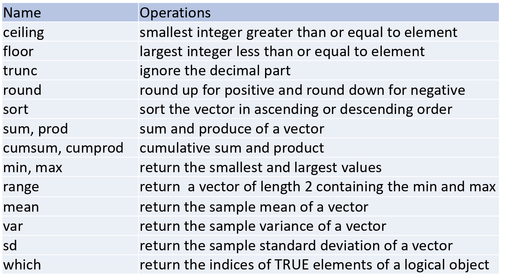

# ***basic built-in operations***

## 1. **system and R lang related**

1. help: `help(<method_name>)`
1. `mode()`: shows the "data type"  
    common data type: numeric, logical (TRUE and FALSE)
1. `ls()` will display all the objects exist in this R session
1. `rm()` remove a existing object  
    `rm(list=ls())`: remove all
1. `options()`: configurations
    1. `options(digits=3)`: display number with 3 digits
1. `proc.time()` return the time like python `time`
1. `exists("name")`: whether exists an object called `name`
1. `traceback()`: When an error occurs, R saves information about the current stack of active functions, and traceback() prints this list. (latest on top, different with python)
    
## 2. **Very basic syntax**

1. Comments
  Use `#` to comment.
  
1. (Especially in R command line,) if want 2 commands in one line, separate with `;`

1. assignment  
    similar to assignment of other languages.  
    can use symbols `=` or `<-`  
    Note: 
    1. but R uses = for yet another purpose: associating function arguments with values. E.g.,  `f(x=3)`.   
    But can also `f(x<-3)`, and in this way after the funciton, `x` is still there since it is global.
    
    1. Technically, `<-` is a global assignment operator, `=` is a local assignment operator. But the local in the outmost environ is global.
    
    1. similar to C, the return value of assignment is the value it assigns
        ```
        Fibonacci[1] <- Fibonacci[2] <- 1
        ```
    
    
  
## 3. **math and logic calculation**

1. Operations and precedence

    {width=70%}  
Notes:  
    1. Associativity  
    Most operators in R have associativity from left to right.  
    Exponent `^` and leftward assignment (`<-`, `=`) and they are from right to left.  
    eg. `5%%3%/%2` means `(5%%3)%/%2` (left to right) `2^3^2` means `2^(3^2)` (right to left)
    1. Inside `()` rearrange priority
    1. Unary minus means the negative sign (?)
    1. The `&` and `|` operator performs the element-wise comparison and returns a logical vector of the same length as its input.  
    `&&` and `||`: beside is 2 logical expression with value `T` or `F`.   

1. Special numbers    

    ```
    > 1/0 
    [1] Inf
    
    > 0/0 
    [1] NaN
    ```

1. Built-in math functions
    1. sqrt, abs, sin, cos, log, exp
    1. others
        
        
    1. other misc


1. Built-in logic functions

    1. `all()` and `any()` 
        1. functions in R can be used to check if all or any values in a vector evaluate to TRUE for some expression. Return is a single `TRUE` or `FALSE`.
        1. Directly do eg `&&` to multi-ele vector can result in error


# ***tricky***

1. ```y<-x<2``` is actually: ```y = (x<2)```
